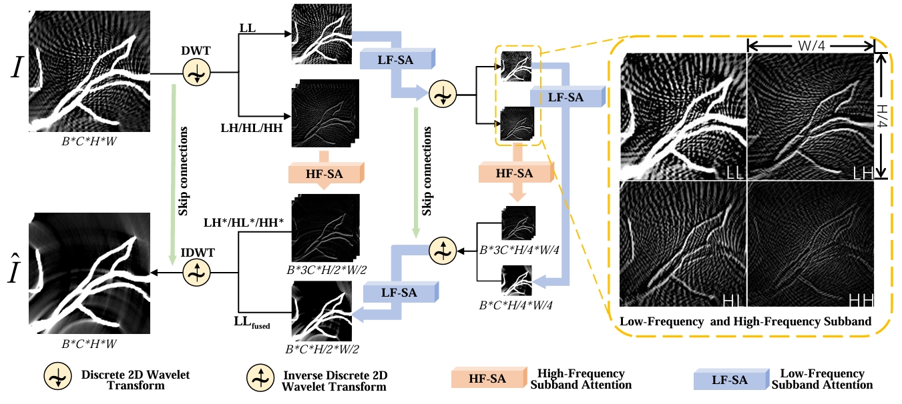

# AD-WaveNet #
A network that integrates the Discrete 2D Wavelet Transform (DWT) with adaptive attention mechanisms to enhance sparse image reconstruction.

Abstract: Photoacoustic tomography (PAT) provide high-contrast and high-resolution biomedical images at rapid speeds. However, the quality of PAT images is sig- nificantly influenced by the sampling density. Sparse sampling can greatly reduce equipment costs but leads to image artifacts and quality degradation. Deep learning models have greatly improved sparse PAT imaging, but their high computational demands restrict their application in settings with limited resources. To address this limitation, we propose AD-WaveNet, a lightweight network integrated the Discrete 2D Wavelet Transform (DWT) with adaptive attention mechanisms to enhance sparse image reconstruction while reducing computational complexity. Attention mechanisms are specifically designed to leverage the multi-scale decomposition properties of DWT, effectively emphasizing key features at different scales. Compared to the latest models, AD-WaveNet achieves a reduction in computational complexity and parameter count by approximately two orders of magnitude. Meanwhile, AD-WaveNet also provides optimal reconstruction quality, demonstrating its great potential for practical PAT imaging applications.

- - - -
## Network Architecture ##


- - - -
## Installation ##
1.Make conda environment
```
conda create -n adwave python=3.7
```
2.Install dependencies
```
pip install -r requirements.txt
```
- - - -
## Dataset ##

The dataset can be accessed at https://drive.google.com/drive/folders/1mgtLv9YjlmMkseq3aK9NBoAClI1wHoMe?usp=drive_link

### Dataset Format

The publicly available dataset is provided in VTK format. Before use, it needs to be converted to TIFF format images. Please use the `vtk2tif.py` script to perform the conversion.

- - - -
## Train ##

### Modify Dataset Path 
In `utils/dataset.py`, locate the line where the dataset path is specified (around line 130 and 131) and update it to the path of your local train dataset. 

In `train.py`, locate the line where the dataset path is specified (around line 145 and 146) and update it to the path of your local val dataset. 

### Training AD-WaveNet 
```
python train.py --lr 0.001 --outf logs/adwave_datasetname_lvl_2_date --lvl 2 --batchSize 128
```
- - - -
## Test ##
```
python test.py  --test_data test_input --test_true_data test_true --load_pth pretrain.pth
```

## Acknowledgements

This project is based on the [WINNet](https://github.com/jjhuangcs/WINNet) created by [jjhuangcs]. We have utilized its code framework and made significant modifications to adapt it to our use case.
